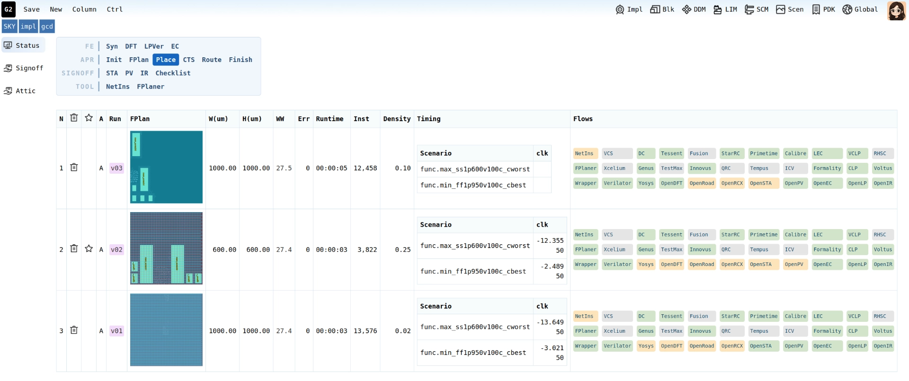

# G2 — Chip Design AI Platform

G2 is a web-based workspace for running and tracking chip design flows,
from RTL to signoff. It runs locally on your Linux machine. You work in a
browser, and G2 manages projects, blocks, libraries, design data and tool
runs for you.



*Three implementation runs of gcd compared in the Impl Status view:
floorplan, die size, density, runtime and timing for each scenario, side
by side.*

This package is the **Community Edition**. It ships with everything needed
to run a complete open-source flow:

| Bundled | Contents |
|---|---|
| EDA tools | OpenROAD, OpenSTA, Yosys (+ yosys-slang), Verilator, Magic, Netgen |
| PDKs | Nangate45, SkyWater 130 (sky130), ASAP7 |
| Demo cases | Ready-to-run examples for each PDK |
| Runtime | Tcl and Node.js. You don't need a system-wide install. |

## Video Tutorials

New to G2? The [Getting Started series](https://www.youtube.com/playlist?list=PLZvKK6r2180A) on YouTube goes from download
to a routed block with signoff timing in about 27 minutes.

| # | Video | Length |
|---|---|---|
| 0 | [Trailer: G2 in one minute](https://www.youtube.com/watch?v=DGXHipKGuOU) | 1:13 |
| 1 | [Install and launch](https://www.youtube.com/watch?v=2w3J3l5PeSk) | 3:07 |
| 2 | [Build a Nangate45 demo project in one command](https://www.youtube.com/watch?v=iwAAUrzuFE8) | 3:55 |
| 3 | [RTL to GDS with Yosys, OpenROAD and OpenSTA](https://www.youtube.com/watch?v=saEB3l4aPWk) | 6:16 |
| 4 | [Design Data Management (DDM)](https://www.youtube.com/watch?v=GpVTZVLqKcw) | 2:26 |
| 5 | [Compare implementation runs side by side](https://www.youtube.com/watch?v=99AJz-IdMXw) | 4:15 |
| 6 | [Debug timing paths with tpath](https://www.youtube.com/watch?v=8SoFOXsoSHk) | 2:19 |
| 7 | [AI assistant for chip design flows](https://www.youtube.com/watch?v=EVPl3y4S0I8) | 3:09 |

---

## Requirements

### Operating system

| OS | G2 platform | Bundled open-source EDA tools |
|---|---|---|
| Ubuntu 22.04 / 24.04 / 25.04 | ✅ Tested | ✅ |
| Rocky / RHEL 8 or later | ✅ | ❌ (needs glibc 2.35+) |

The G2 platform itself runs on Rocky/RHEL 8 or later. The bundled
OpenROAD, Yosys and Verilator binaries need **glibc 2.35 or later**, which
means Ubuntu 22.04 or later. You only need Ubuntu if you plan to run the
bundled open-source flows.

### System packages

G2 uses these standard command-line tools: `xterm`, `tcsh`, `gvim`,
`firefox`, `tclsh`, `nproc`, `zcat`.

On Ubuntu:

```bash
sudo apt-get install -y xterm tcsh vim-gtk3 firefox tcl coreutils gzip
```

---

## Quick Start

```bash
# 1. Download and extract (about 530 MB). There is no install step.
wget https://github.com/DeepDataFlow/G2/releases/download/v1.0.0/G2_v1.0.0.tar.gz
tar zxvf G2_v1.0.0.tar.gz

# 2. Create a workspace next to the extracted package and initialize it
mkdir g2
cd g2
../G2_v1.0.0/g2/bin/g2init

# 3. Load the environment and start the server
source g2.rc
g2
```

`g2` opens an xterm that runs the G2 server. The xterm prints a login URL
like this one:

```
Open this URL to authenticate:
  http://localhost:6003/?token=xxxxxxxx
```

Open that URL in Firefox (`firefox &`). You'll see the G2 home page.

Prefer to watch? [Tutorial #1](https://www.youtube.com/watch?v=2w3J3l5PeSk) walks through these steps.

### Next: get a project to work on

There are two ways to start. Both give you the `gcd` and `spm` blocks with
signoff scenarios and libraries already set up.

**Follow the video series (Nangate45).** One script builds the demo
project that the tutorials use. It takes a few seconds:

```bash
$G2_ROOT/demo_case/nangate45/build.sh
```

Refresh the G2 home page, and the `nangate45` project appears. Then follow
[Tutorial #2](https://www.youtube.com/watch?v=iwAAUrzuFE8) for a tour of the project and
[Tutorial #3](https://www.youtube.com/watch?v=saEB3l4aPWk) to run the flow. The same script exists for
`sky130` and `asap7` under `$G2_ROOT/demo_case/`.

**Start from a complete project (sky130).** Clone
**[G2_demo_sky130](https://github.com/DeepDataFlow/G2_demo_sky130)** into
your workspace. It adds pre-configured flows for a `v01` run and reference
QoR to compare your runs against.

```bash
cd $G2_SYS/projs
git clone https://github.com/DeepDataFlow/G2_demo_sky130
cd G2_demo_sky130
make setup
```

See the [G2_demo_sky130 README](https://github.com/DeepDataFlow/G2_demo_sky130#readme)
for details.

---

## What the Setup Commands Do

| Step | What happens |
|---|---|
| `g2init` | Turns the current directory into a G2 workspace (`$G2_SYS`). It picks a free port starting at 6003, creates `projs/`, `server/` and `tmp/`, and writes `g2.rc`. |
| `source g2.rc` | Sets `G2_ROOT` and `G2_SYS` and adds G2 and the bundled EDA tools to `PATH`. It works with both bash and tcsh. |
| `g2` | Starts the G2 web server in an xterm. The server listens on `127.0.0.1` only, so other machines can't reach it. |

Options:

```bash
g2init -port 6100     # use a specific port instead of auto-selecting one
g2 --no-auth          # start without the login token (localhost only)
```

---

## Everyday Use

Each time you open a new shell:

```bash
cd g2            # your workspace
source g2.rc
g2
```

Stop the server by closing its xterm. Your data stays in the workspace
directory.

---

## Troubleshooting

| Symptom | Fix |
|---|---|
| `g2: command not found` | Run `source g2.rc` from inside the workspace. |
| No window appears after `g2` | Install `xterm` and make sure `$DISPLAY` is set. |
| The browser asks for a login or shows "unauthorized" | Use the full `?token=...` URL printed in the G2 xterm. |
| ``version `GLIBC_2.35' not found`` | The host OS is too old for the bundled EDA tools. Use Ubuntu 22.04 or later. |
| The port is already in use | Re-run `g2init -port <port>` with a free port. |
